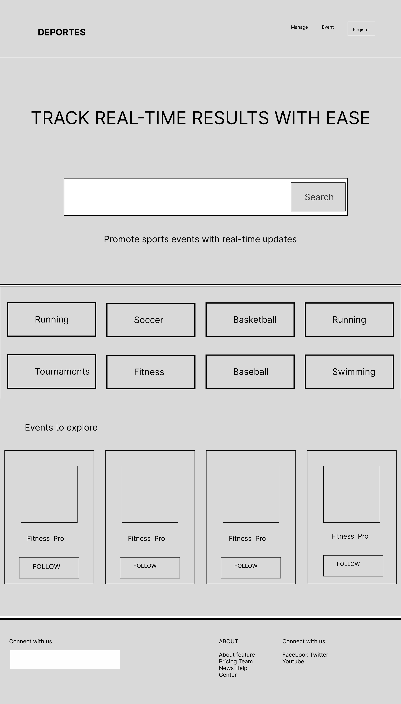

# Plataforma de Gestión de Eventos Deportivos

---

## Título del Proyecto: Sportify

---

## Brief o Descripción

**Sportify** es una plataforma innovadora que se enfoca en la gestión integral de eventos deportivos. Proporciona a los organizadores las herramientas necesarias para crear, gestionar y promocionar sus competencias, mientras que facilita a los participantes la inscripción, seguimiento de resultados y acceso a toda la información relevante en tiempo real. La plataforma está diseñada para manejar eventos de diferentes escalas, desde competiciones locales hasta torneos internacionales, asegurando una experiencia fluida tanto para organizadores como para atletas.

---

## Fases del Proyecto

El desarrollo de Sportify se plantea en fases para asegurar una implementación efectiva y escalable, garantizando que las características más importantes estén disponibles desde el principio, con mejoras y funcionalidades adicionales en fases posteriores.

### Fase 1: Inscripción y Gestión Básica de Eventos 🚀

**Módulos a Implementar:**

- **Registro y Autenticación de Usuarios:**
  - Implementar un sistema seguro de registro y autenticación, permitiendo a los organizadores crear cuentas y a los participantes inscribirse en eventos.
- **Creación y Gestión de Eventos:**
  - Herramientas básicas para que los organizadores puedan crear eventos deportivos, especificar detalles como fecha, ubicación, y reglas.
- **Inscripción de Participantes:**
  - Permitir que los participantes se inscriban en los eventos, con opciones para inscripciones individuales o por equipos.
- **Visualización de Calendarios:**
  - Generar y mostrar calendarios de eventos que los participantes y organizadores puedan consultar.

**Objetivo:** Establecer las funcionalidades básicas que permitan la creación y gestión de eventos, asegurando que los usuarios puedan registrarse y participar en eventos deportivos.

---

### Fase 2: Pagos y Resultados en Tiempo Real 🚀🚀

**Módulos a Implementar:**

- **Gestión de Pagos:**
  - Integrar una pasarela de pagos para que los organizadores puedan cobrar las inscripciones, y los participantes paguen directamente desde la plataforma.
- **Resultados en Tiempo Real:**
  - Implementar un sistema para que los resultados de las competencias se actualicen en tiempo real, permitiendo a los participantes y espectadores seguir el progreso de los eventos.
- **Notificaciones y Comunicación:**
  - Añadir notificaciones push y correo electrónico para mantener a los participantes informados sobre actualizaciones importantes, cambios en horarios, o resultados.

**Objetivo:** Facilitar la gestión financiera del evento y mejorar la experiencia del usuario con la inclusión de resultados en tiempo real y comunicaciones eficaces.

---

### Fase 3: Personalización y Análisis Avanzado 🚀🚀🚀

**Módulos a Implementar:**

- **Personalización de Perfiles y Eventos:**
  - Permitir a los organizadores personalizar sus eventos con logotipos, colores y branding específico, y a los participantes personalizar sus perfiles.
- **Análisis y Reportes:**
  - Desarrollar módulos de análisis que permitan a los organizadores ver estadísticas detalladas sobre inscripciones, pagos, y rendimiento de los participantes.
- **Integración con Redes Sociales:**
  - Facilitar la integración con redes sociales para que los eventos y resultados puedan ser compartidos fácilmente, aumentando la visibilidad del evento.

**Objetivo:** Mejorar la experiencia del usuario mediante la personalización y ofrecer a los organizadores herramientas avanzadas para el análisis de datos y promoción de sus eventos.

---

## Layout Principal (Idea Básica)

---
