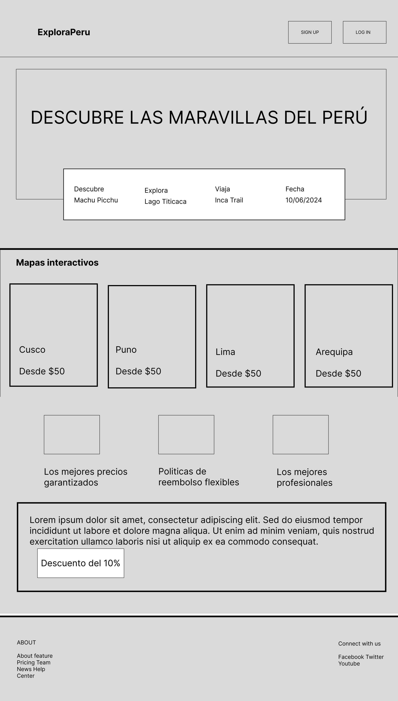

# Plataforma de Turismo Cultural y Aventura por Regiones

---

## Título del Proyecto: ExplorePeru

---

## Brief o Descripción

**ExplorePeru** es una plataforma innovadora diseñada para promover el turismo cultural y de aventura en todas las regiones del Perú. Proporciona a los viajeros las herramientas necesarias para descubrir destinos turísticos, reservar experiencias auténticas y recibir itinerarios personalizados, mientras que facilita a los guías locales y operadores turísticos la promoción y gestión de sus servicios. La plataforma está diseñada para ofrecer una experiencia inmersiva y educativa, destacando la riqueza cultural y natural de cada región del Perú.

---

## Fases del Proyecto

El desarrollo de ExplorePeru se plantea en fases para asegurar una implementación efectiva y escalable, garantizando que las características más importantes estén disponibles desde el principio, con mejoras y funcionalidades adicionales en fases posteriores.

### Fase 1: Exploración y Reservas Básicas 🚀

**Módulos a Implementar:**

- **Registro y Autenticación de Usuarios:**
  - Implementar un sistema seguro de registro y autenticación, permitiendo a los viajeros crear cuentas y a los guías locales gestionar sus perfiles.
- **Exploración de Destinos:**
  - Herramientas para que los usuarios puedan explorar destinos turísticos por región, categoría (cultural, aventura, ecológico) y tipo de actividad.
- **Reservas de Tours:**
  - Permitir que los usuarios reserven tours y experiencias directamente desde la plataforma, con opciones de pago integradas.
- **Visualización en Mapas:**
  - Integrar Google Maps o Mapbox para mostrar la ubicación de los destinos y tours disponibles, facilitando la planificación del viaje.

**Objetivo:** Establecer las funcionalidades básicas que permitan a los usuarios explorar destinos turísticos y realizar reservas, asegurando una experiencia inicial fluida y atractiva.

---

### Fase 2: Pagos y Comunicaciones en Tiempo Real 🚀🚀

**Módulos a Implementar:**

- **Gestión de Pagos:**
  - Integrar una pasarela de pagos para que los usuarios puedan pagar sus reservas directamente desde la plataforma, y los guías locales reciban sus pagos de manera segura.
- **Chat en Tiempo Real:**
  - Implementar un sistema de chat en tiempo real para que los usuarios puedan comunicarse con guías locales y operadores turísticos, resolver dudas y coordinar detalles del viaje.
- **Notificaciones y Seguimiento:**
  - Añadir notificaciones push y correos electrónicos para mantener a los usuarios informados sobre el estado de sus reservas, itinerarios y cambios de última hora.

**Objetivo:** Facilitar la gestión financiera de las reservas y mejorar la comunicación entre los usuarios y guías locales, ofreciendo una experiencia más conectada y eficiente.

---

### Fase 3: Personalización y Contenido Premium 🚀🚀🚀

**Módulos a Implementar:**

- **Suscripción Premium:**
  - Ofrecer una versión premium de la plataforma que proporcione beneficios exclusivos como descuentos en tours, acceso a itinerarios personalizados y contenido educativo premium.
- **Análisis y Recomendaciones:**
  - Desarrollar módulos de análisis que permitan a los usuarios recibir recomendaciones personalizadas basadas en sus intereses y actividades anteriores.
- **Contenido Exclusivo Bajo Paywall:**
  - Crear una sección de contenido exclusivo que solo esté disponible para usuarios premium, incluyendo guías detalladas, videos y artículos educativos sobre destinos específicos.

**Objetivo:** Mejorar la experiencia del usuario mediante la personalización y ofrecer opciones de valor añadido a través de una suscripción premium, incrementando la lealtad y el compromiso de los usuarios.

---

## Layout Principal (Idea Básica)

---
